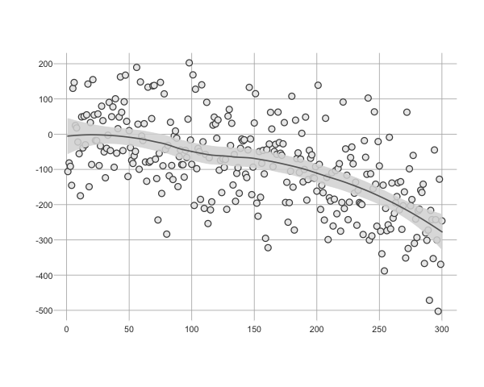
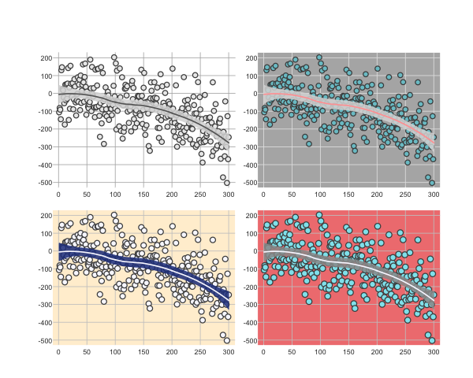

### Gill-Hall Graphics (GHG)

Here we introduce our graphics theme.  The theme is intended to improve upon the R base defaults in a variety of ways.

Our approach is based on several goals.  First, we wanted more logical defaults than the ones included in base, which offer ugly looking point styles (in our opinion), annoying axis labels, axis tick marks that are way too long, and a variety of other similar problems.  Second, we wanted to keep the simple syntax and logic of base (others will prefer to use ggplot which is of course fine).  Finally, we wanted to make it easy to change the colors of points, lines, and especially the plot background and gridlines.  The result of these ideas is the plot.gh function (or, if you will, "ghplot"!).


### Working Example

To get started, we load in plot.gh as well as several helper functions.

```{r}
source("GHG.R")
```

Next, we make some test data

```{r}
set.seed(94304)
X <- 1:300
Y <-  .0002*X - .003*X^2 + rnorm(n=length(X), mean=0, sd=100)
```

Here's the default plot.

```{r}
par.gh()
plot.gh(X, Y)
loessCI(X, Y)
```




Here are a few more examples, with the default in the top left for comparison.


```{r}
par.gh(mfrow=c(2,2), oma=c(3,3,3,3), mar=c(.1,2,2,.1))
plot.gh(X, Y)
loessCI(X, Y)

plot.gh(X, Y, bg="cadetblue3", outer.box =T,outer.box.col="white", rect_col="gray70", grid_col="gray90")
loessCI(X, Y, line_col="#FFA3A3")

plot.gh(X, Y, bg="ghostwhite", outer.box =T,outer.box.col="white", rect_col="papayawhip", grid_col="gray79", point.size=1.4)
loessCI(X, Y, poly_col="royalblue4", line_col="ghostwhite")

plot.gh(X, Y, bg="cadetblue2", outer.box =T,outer.box.col="white", rect_col="lightcoral", grid_col="gray79", point.size=1.5)
loessCI(X, Y, poly_col="gray60", line_col="ghostwhite")
```



