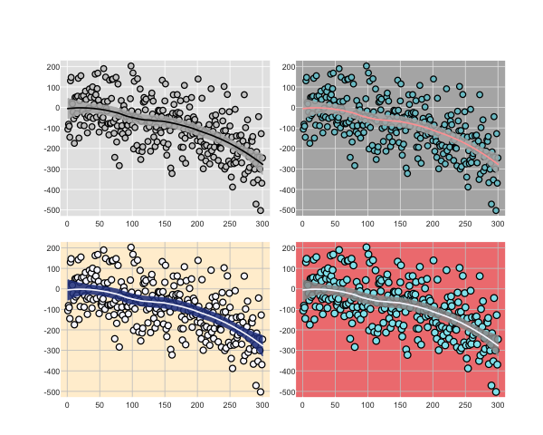

### Gill-Hall Graphics (GHG)

Here we introduce our graphics theme.  The theme is intended to improve upon the R base defaults in a variety of ways.

### Working Example

To get started, we need to make sure we have our functions loaded.

```{r}
source("GHG.R")
```

First, we make some test data

```{r}
set.seed(94304)
X <- 1:300
Y <-  .0002*X - .003*X^2 + rnorm(n=length(X), mean=0, sd=100)
```

First, here's the default plot.

```{r}
par.gh()
plot.gh(X, Y)
loessCI(X, Y)
```


```{r}
pdf(file="example.pdf", height=6, width=8)
par.gh(mfrow=c(2,2), oma=c(3,3,3,3), mar=c(.1,2,2,.1))
plot.gh(X, Y)
loessCI(X, Y)

plot.gh(X, Y, bg="cadetblue3", outer.box =T,outer.box.col="white", rect_col="gray70", grid_col="gray90")
loessCI(X, Y, line_col="#FFA3A3")

plot.gh(X, Y, bg="ghostwhite", outer.box =T,outer.box.col="white", rect_col="papayawhip", grid_col="gray79", point.size=1.4)
loessCI(X, Y, poly_col="royalblue4", line_col="ghostwhite")

plot.gh(X, Y, bg="cadetblue2", outer.box =T,outer.box.col="white", rect_col="lightcoral", grid_col="gray79", point.size=1.5)
loessCI(X, Y, poly_col="gray60", line_col="ghostwhite")
dev.off()
```



